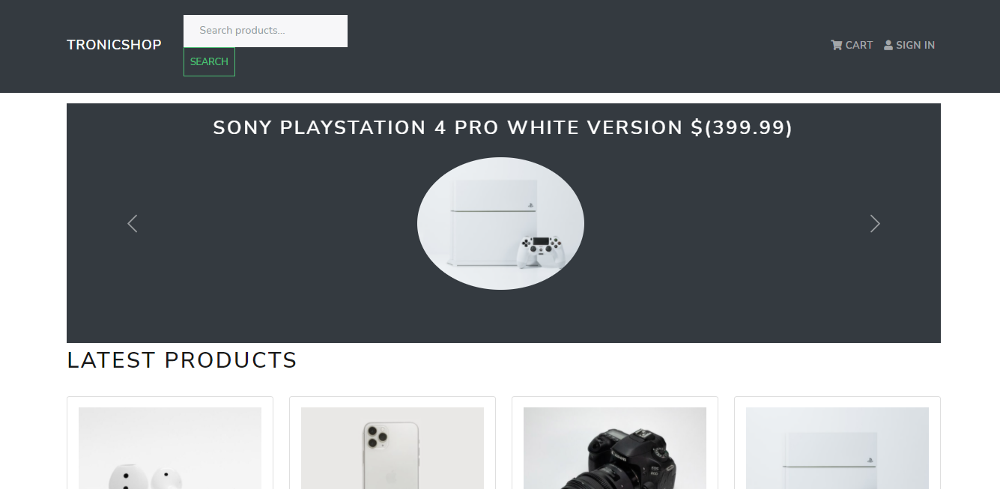

# TronicShop

> In this project I created a SEO application using NodeJS, reactJS, Redux, PayPal

tronicShop is an online eletronic shop. Stack- NodeJS, ReactJS, Redux, PayPal.

## Built With

- ReactJS and Redux
- Redux-thunk, Redux-logger, axios.
- React BootStrap
- NodeJS

## Live Demo

[Live Demo Link](https://sad-heyrovsky-c7f6a5.netlify.app/)

## Getting Started

To get a local copy up and running follow these simple steps.

### Prerequisites
- A working Laptop or Desktop
- Internet
- Knowledge of React, Redux, TDD, CSS

### Setup
- Install code editor
- Install Git bash
- Install react app
- Install react-redux
### Install

- React:
npx create-react-app the-app-name
- Redux: 
npm install redux react-redux 

### Dependencies

## Frontend

- React-bootstrap
- React-router-dom react-router-bootstrap
- Axios
- Redux
- React-redux
- Redux-thunk
- Redux-devtools-extension
- react-paypal-button-v2

## Backend

- express
- nodemon
- concurrently
- dotenv
- mongoose
- bcryptjs
- express-async-handler
- jsonwebtoken
- multer

### Clone Project
[tronicShop](https://github.com/Emmy-github-webdev/tronicshop)

### Usage

The tronicShop is an eCommerce platform to purchase electronics online.

### Run tests
- npm run start
- npm run test

### Deployment
- [Netlify](https://www.netlify.com/)

- [Heroku](https://www.heroku.com/)

## Authors

👤 *Emmanuel Ogah*

- GitHub: [@githubhandle](https://github.com/githubhandle)
- Twitter: [@twitterhandle](https://twitter.com/twitterhandle)
- LinkedIn: [LinkedIn](https://linkedin.com/in/linkedinhandle)

## 🤝 Contributing

Contributions, issues, and feature requests are welcome!

Feel free to check the [issues page](https://github.com/Emmy-github-webdev/tronicshop/issues).

## Show your support

Give a ⭐ if you like this project!

## Acknowledgments

- [Brad Traversy](https://github.com/bradtraversy/).
- Inspiration
